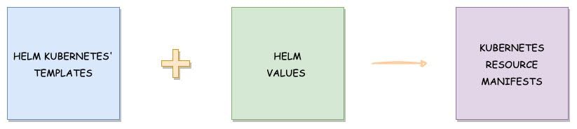
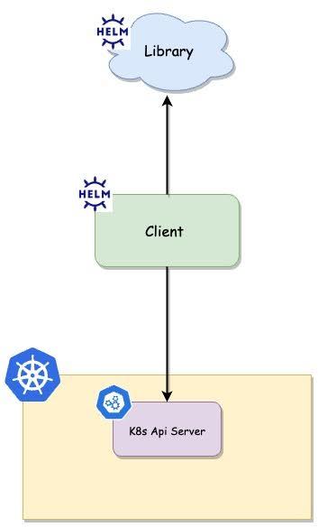

> Quellenangabe:
> - Ursprung: [middleware.io](https://middleware.io/blog/helm-chart-tutorial/ "null")
> - Überarbeitet von P. Stark
> - Experiment: Übersetzung per Google Gemini. (Es hat definitiv noch Fehler drin...)

# Erste Schritte mit Helm

## Was ist Helm?

Helm ist ein Paketmanager für Kubernetes-Applikationen. Es hilft Entwicklern, Pakete für die komplexesten Kubernetes-Anwendungen zu erstellen, zu installieren, zu konfigurieren, bereitzustellen und zu aktualisieren. Es ist einfach, die [CI/CD-Pipeline](https://middleware.io/blog/what-is-a-ci-cd-pipeline/ "null") für Workloads zu optimieren, da Helm eine einfache und reproduzierbare Möglichkeit bietet, [Kubernetes-Anwendungen](https://middleware.io/blog/kubernetes-monitoring/ "null") zu paketieren und zu verteilen.

Helm ist ein Open-Source-Projekt, das von DeisLabs ins Leben gerufen und später an die Cloud Native Computing Foundation (CNCF) gespendet wurde. Bis heute wird es von der CNCF gepflegt.

Dieser Artikel beleuchtet Helm eingehend und behandelt seine Definition, Architektur und Installation. Er untersucht auch die Gründe für die Verwendung von Helm, bietet eine Schritt-für-Schritt-Anleitung zur Nutzung von Helm Charts, diskutiert die Vor- und Nachteile von Helm und erkundet seine Integration mit Middleware.

## Was ist ein Helm Chart in Kubernetes?

Helm verwendet "Charts", um alle notwendigen Ressourcen und Konfigurationen der Anwendung zu paketieren. Ein Helm Chart ist wie eine Blaupause für die Bereitstellung jeder Anwendung auf Kubernetes.

Es enthält alle YAML-Manifestdateien der Kubernetes-Ressourcen, die zum Ausführen unserer Anwendung benötigt werden, sowie einige Helm-bezogene Dateien, die in einer bestimmten Verzeichnisstruktur organisiert sind. Es verwendet ein Templating-System, das auf dem Go-Template basiert, um Kubernetes-Manifeste aus Charts zu rendern.

Einfach ausgedrückt: Helm verfügt über vordefinierte k8s-Templates, an die es die Werte übergibt, die wir in einer Datei definiert haben, und stellt die Ressourcen im Cluster bereit.



Helm Charts erleichtern das Teilen und Reproduzieren von Anwendungen über verschiedene Kubernetes-Cluster hinweg.

## Helm-Installation

Es gibt verschiedene Möglichkeiten, Helm auf unserem System zu installieren. Schauen wir sie uns nacheinander an.

**Verwendung eines binären Release:**

1. Laden Sie die Version, die Sie installieren möchten, von [hier](https://github.com/helm/helm/releases "null") herunter.
    
2. Entpacken Sie sie mit dem Befehl: `**tar -zxvf helm-v3.0.0-linux-amd64.tar.gz**`
    
3. Finden Sie nun die `helm`-Binärdatei im entpackten Verzeichnis und verschieben Sie sie an den gewünschten Zielort. `**mv <helm-binary-path> <local-bin-path>**`
    
    Beispiel: mv linux-amd64/helm /usr/local/bin/helm
    
4. Führen Sie nun den folgenden Befehl aus, um die Version zu überprüfen: `**helm version**`
    

**Verwendung eines Skripts:**

Führen Sie die folgenden Befehle aus, wenn Sie es über das Skript ausführen möchten; es wird die neueste Version installiert.

```
 curl -fsSL -o get_helm.sh  [https://raw.githubusercontent.com/helm/helm/main/scripts/get-helm-3](https://raw.githubusercontent.com/helm/helm/main/scripts/get-helm-3)

chmod 700 get_helm.sh

./get_helm.sh
```

**Verwendung eines Paketmanagers:**

Wir können Helm auch über verschiedene Paketmanager wie homebrew, yum usw. installieren. Weitere Details finden Sie in der [offiziellen Dokumentation](https://helm.sh/docs/intro/install/ "null").

## Helm-Architektur

Helm basiert auf einer modularen Architektur, die aus zwei Hauptkomponenten besteht: dem Helm Client und der Helm Library.

1. **Helm Client**: Das Helm CLI ist eine Befehlszeilenschnittstelle, die auf der client-go-Bibliothek von Kubernetes aufbaut. Es ist das Tor des Benutzers zur Interaktion mit Helm. Es ermöglicht Benutzern, neue Charts zu erstellen, Repositories zu verwalten und Releases freizugeben.
    
2. **Helm Library:** Die Helm-Bibliothek ist die Kern-Engine, die von Clients verwendet wird, um mit dem Kubernetes API-Server zu interagieren, um Charts zu installieren, zu aktualisieren oder zurückzusetzen und andere Helm-Operationen durchzuführen.

    

In älteren Helm-Versionen war Tiller, eine serverseitige Komponente, für die Interaktion zwischen dem Client und dem Kubernetes API-Server sowie für die Verwaltung von Releases im [Kubernetes-Cluster](https://middleware.io/product/container-monitoring/ "null") verantwortlich.

Seit Helm v3 wurde Tiller jedoch zugunsten einer reinen Client-Architektur abgeschafft. Helm interagiert nun direkt mit dem Kubernetes API-Server. Diese Änderung erhöht die Sicherheit und vereinfacht die Architektur von Helm.

### Warum sollten Sie Helm verwenden?

Unten sind einige Gründe, warum Sie Helm verwenden sollten:

1. **Vereinfachte Anwendungsbereitstellung**:
    
    - **Problem**: Die Bereitstellung komplexer Kubernetes-Anwendungen kann beunruhigend und fehleranfällig sein.
        
    - **Lösung**: Helm erleichtert das Definieren, Installieren und Aktualisieren. Helm ermöglicht es Ihnen, Anwendungen in einem einzigen Chart zu paketieren, was die Verwaltung und Bereitstellung vereinfacht.
        
2. **Versionskontrolle für Deployments**:
    
    - **Problem**: Schwierigkeiten bei der Verwaltung verschiedener Versionen einer Anwendung über Umgebungen hinweg.
        
    - **Lösung**: Helm Charts ermöglichen die Versionierung. Es hilft Ihnen, Ihre Anwendungsbereitstellungen zu verfolgen.
        
3. **Template-basierte Konfiguration**:
    
    - **Problem**: Inkonsistenzen und Fehler bei der Konfiguration von Anwendungen für verschiedene Umgebungen.
        
    - **Lösung**: Das Templating von Helm hilft Ihnen, Konfigurationswerte einfach zu definieren und Anwendungsressourcen für verschiedene Umgebungen anzupassen.
        
4. **Abhängigkeitsmanagement**:
    
    - **Problem**: Abhängigkeit von mehreren Komponenten oder Ressourcen, die zusammen bereitgestellt werden müssen.
        
    - **Lösung**: Ein Hauptmerkmal von Helm ist seine Fähigkeit, Abhängigkeiten zwischen verschiedenen Chart-Paketen zu verwalten. Helm Charts stellen sicher, dass alle Komponenten korrekt konfiguriert und bereitgestellt werden.
        
5. **Zusammenarbeit und Wiederverwendbarkeit**:
    
    - **Problem**: Die Herausforderung beim Teilen und Replizieren von Anwendungskonfigurationen über Projekte hinweg.
        
    - **Lösung**: Helm Charts können geteilt und wiederverwendet werden. Dies erleichtert Teams die Zusammenarbeit und die Wahrung der Konsistenz.
        
6. **Rollback und Upgrade-Fähigkeit**:
    
    - **Problem**: Das Aktualisieren von Anwendungen ohne eine klare Rollback-Strategie kann zu Ausfallzeiten oder kritischen Problemen führen.
        
    - **Lösung**: Helm ermöglicht es Ihnen, Ihre Anwendung auf eine bestimmte Version zu aktualisieren und zurückzusetzen. Dies reduziert das Risiko von Ausfallzeiten und gewährleistet eine kontinuierliche Verfügbarkeit.
        

### Helm-Chart-Struktur

Erstellen wir ein Chart, indem wir den Befehl `helm create` ausführen, um das Helm-Chart zu verstehen.

```
helm create test-chart
```

#### Erstellen von test-chart

Hier haben wir ein Chart namens _test-chart_ erstellt. Ein Verzeichnis namens _test-chart_ wird automatisch erstellt und kann durch Ausführen des `ls`-Befehls überprüft werden. Jetzt können Sie durch das Verzeichnis gehen und die darin enthaltenen Dateien überprüfen.

Führen Sie den `tree`-Befehl aus, um die Struktur zu überprüfen:

```

 tree test-chart/ 
test-chart/
├── Chart.yaml
├── charts
├── templates
│   ├── NOTES.txt
│   ├── _helpers.tpl
│   ├── deployment.yaml
│   ├── hpa.yaml
│   ├── ingress.yaml
│   ├── service.yaml
│   ├── serviceaccount.yaml
│   └── tests
│       └── test-connection.yaml
└── values.yaml
```

**4 Verzeichnisse, 10 Dateien**

Schauen wir uns jede Datei und jedes Verzeichnis in einem Helm-Chart an und verstehen ihre Bedeutung.

1. **.helmignore:** Dies ist eine versteckte Datei, weshalb wir sie in der Chart-Struktur nicht sehen können. Führen Sie den Befehl `ls -a` aus dem Verzeichnis heraus aus, um sie zu überprüfen. Sie wird verwendet, um alle Dateien zu definieren, die wir nicht in das Helm-Chart aufnehmen möchten.
    
2. **Chart.yaml:** Sie enthält die grundlegenden Informationen über das Chart.
    
3. **charts:** Dies ist ein leeres Verzeichnis. Wir können hier die Struktur jedes Charts hinzufügen, von dem unser Haupt-Chart abhängt.
    
4. **templates:** Dies ist ein Verzeichnis, das alle Kubernetes-Manifestdateien enthält, die eine Anwendung erstellen. Standardmäßig hat Helm die Manifestdateien _deployment.yaml_, _service.yaml, hpa.yaml, ingress.yaml, serviceaccount.yaml_ erstellt. Wir können diese Dateien nach unseren Bedürfnissen ändern und überschreiben. Wir können sogar Manifestdateien anderer Kubernetes-Objekte hinzufügen. Diese Manifestdateien können als Template gestaltet werden, um auf Werte aus der _values.yaml_-Datei zuzugreifen.
    
5. **templates/NOTES.txt:** Dies ist eine reine Textdatei, die ausgegeben wird, nachdem das Chart erfolgreich bereitgestellt wurde.
    
6. **templates/_helpers.tpl:** Diese Datei enthält mehrere Methoden und Unter-Templates. Sie hilft dabei, unsere Charts organisiert zu halten und die Wiederholung desselben Codes an mehreren Stellen zu vermeiden.
    
7. **templates/tests/:** Wir können hier Tests in unseren Charts definieren, um zu validieren, dass unser Chart wie erwartet funktioniert, wenn es installiert wird.
    
8. **values.yaml**: Diese Datei enthält die Werte für die Manifestdateien im Templates-Verzeichnis. Zum Beispiel Image-Name, Anzahl der Replikate, HPA-Werte usw. Wir können verschiedene _values.yaml_-Dateien basierend auf den Umgebungen erstellen und die Werte ändern.
    

## Helm-Chart-Tutorial: Eine Schritt-für-Schritt-Anleitung

Schauen wir uns ein Beispiel an und stellen ein Chart selbst bereit. Wir werden tief in die Verzeichnisse und Dateien der Helm-Struktur eintauchen. Wir werden das Chart modifizieren, das wir im vorherigen Schritt erstellt haben. Überprüfen wir die Dateien und bearbeiten sie nacheinander, wo immer es erforderlich ist.

### `Chart.yaml`

Wie wir wissen, erwähnen wir alle Informationen bezüglich des Charts in dieser Datei, wie den Namen und Typ des Charts, eine Beschreibung des Charts, Versionen und alles Weitere.

```
apiVersion: v2
name: test-chart
description: Test Helm Chart For Tutorial
type: application
version: 0.1.0
appVersion: "1.0.0"
```

Schauen wir uns jedes Feld einzeln an:

1. **apiVersion**: Bezieht sich auf die Chart-API-Version. v2 ist die aktuelle apiVersion für die Helm 3-Version.
    
2. **name:** Dieses Feld bezieht sich auf den Namen des Charts.
    
3. **description:** Eine einzeilige Angabe über das Helm-Chart.
    
4. **Type**: Es gibt 2 Chart-Typ-Optionen: **application** und **library.** Typ `application` bezieht sich auf die Charts, die wir auf Kubernetes bereitstellen. Typ `library` bezieht sich auf die Charts, die wiederverwendbar sind und mit anderen Charts verwendet werden können.
    
5. **Version**: Bezieht sich auf die Version unseres Charts.
    
6. **appVersion**: Beschreibt die Versionsnummer unserer Anwendung.
    

Es gibt auch einige andere Felder wie _maintainers, dependencies, icons_, etc.

### **templates**

Wir haben bereits über den Templates-Ordner gesprochen, der templatisierte Kubernetes-Manifestdateien einiger gängiger Ressourcen enthält. Möglicherweise benötigen wir jedoch einige andere Ressourcen in unserer Anwendung, die wir als Templates erstellen müssen. Wir können auch die Ressourcen entfernen, die wir nicht benötigen.

Vorerst werden wir 2 Ressourcen verwenden: Deployment und Service. Entfernen wir also andere Dateien und Ordner. Unser Ordner wird so aussehen:

```
 tree templates/ 
templates/
├── _helpers.tpl
├── deployment.yaml
└── service.yaml
```

**1 Verzeichnis, 3 Dateien**

Wir können auch die Felder in der Manifestdatei nach unseren Bedürfnissen entfernen oder hinzufügen. Unsere _deployment.yaml_ und _service.yaml_ werden also so aussehen:

**deployment.yaml**

```
apiVersion: apps/v1 
kind:  Deployment
metadata: 
  name: {{ include "test-chart.fullname" . }}
  labels:
    {{- include "test-chart.labels" . | nindent 4 }}
spec:
  replicas: {{ .Values.replicaCount }}
  selector:
    matchLabels:
      {{- include "test-chart.selectorLabels" . | nindent 6 }}
  template:
    metadata:
      {{- with .Values.podAnnotations }}
      annotations:
        {{- toYaml . | nindent 8 }}
      {{- end }}
      labels:
        {{- include "test-chart.selectorLabels" . | nindent 8 }}
    spec:
      containers:
        - name: {{ .Chart.Name }}
          image: "{{ .Values.image.repository }}:{{ .Values.image.tag | default .Chart.AppVersion }}"
          imagePullPolicy: {{ .Values.image.pullPolicy }}
          ports:
            - name: http
              containerPort: 80
              protocol: TCP
```

**Service.yaml**

```
apiVersion: v1 
kind:  Service
metadata: 
  name: {{ include "test-chart.fullname" . }}
  labels:
    {{- include "test-chart.labels" . | nindent 4 }}
spec:
  type: {{ .Values.service.type }}
    ports:
      - port: {{ .Values.service.port }}
        targetPort: {{ .Values.service.targetPort }}
        protocol: TCP
        name: {{ .Values.service.name }}
  selector:
    {{- include "test-chart.selectorLabels" . | nindent 4 }}
```

Wir verwenden Templates für die Kubernetes-Objektmanifestdateien, damit wir sie in mehreren Umgebungen wiederverwenden können, indem wir ihnen dynamisch Werte über die `values`-Datei jeder Umgebung zuweisen. Lassen Sie uns diese Templates verstehen.

Helm verwendet Template-Direktiven, bei denen wir den Objekt-Parameter in geschweiften Klammern angeben.

```
{{ .Object.Parameter }}
```

Es gibt verschiedene [Objekte](https://helm.sh/docs/chart_template_guide/builtin_objects/ "null"), die wir verwenden können. In unseren Templates verwenden wir Chart und Values. Wir erwähnen das Chart-Objekt für die Verwendung der in der _Chart.yaml_ definierten Parameter und das Values-Objekt für _values.yaml_.

Zum Beispiel in der _deployment.yaml_-Datei:

Für den Schnipsel **{{ .Values.replicaCount }}** prüft Helm die _values.yaml_-Datei, findet den _replicaCount_-Parameter, nimmt dessen Wert und rendert ihn in der _deployment.yaml_-Datei. Ähnlich beim Schnipsel **{{ .Chart.Name }}** prüft es die _Chart.yaml_-Datei, findet den _Name_-Parameter und holt dessen Wert.

Wir sehen auch einen Schnipsel **{{ include “test-chart.fullname” . }}**, hier haben wir das Schlüsselwort `include` verwendet. Damit weisen wir Helm an, die `_helpers.tpl`-Datei zu prüfen, in der einige Standard-Templates definiert sind, und den Wert von dort zu holen. Es wird also nach **`test-chart.fullname`** suchen und den Wert gemäß der dortigen Definition abrufen.

### **Values.yaml**

Die _values.yaml_-Datei ist eine Konfigurationsdatei, die verwendet wird, um Standardwerte für verschiedene Parameter festzulegen. Alle Werte in dieser Datei werden in die Template-Direktiven eingesetzt, die wir in den Templates verwendet haben.

Die Datei ist als Schlüssel-Wert-Paare strukturiert, wobei der Schlüssel das Feld des Kubernetes-Objekts bezeichnet. Ersetzen wir den Standardinhalt von _values.yaml_ durch Folgendes.

```
replicaCount:  2
image: 
  repository: nginx
  tag: "1.25.3"
  pullPolicy: Always

service: 
  name: nginx-service
  type: ClusterIP
  port: 80
  targetPort: 8080
```

Hier verwenden wir beispielhaft nur eine `values.yaml`-Datei. Wir können je nach Umgebung mehrere _value_-Dateien haben.

Angenommen, wir haben 4 Umgebungen in unserem Projekt: dev, qa, uat, prod. Wir können diese _values-dev.yaml_, _values-qa.yaml_, _values-uat.yaml_ und _values-prod.yaml_ nennen.

Jetzt können wir mit diesen verschiedenen Dateien unsere Werte je nach den Anforderungen der Umgebung anpassen. Zum Beispiel benötigen wir möglicherweise mehr Pod-Replikate in den uat- und prod-Umgebungen, also können wir den Wert von `replicaCount` in den entsprechenden Dateien ändern.

Zur Installationszeit können wir den Dateinamen im Befehl übergeben. Das Template des Objekts nimmt dann die Werte entsprechend entgegen und wird im Cluster bereitgestellt.

### **Das Helm-Chart validieren**

Um unsere Helm-Charts vor der eigentlichen Bereitstellung zu validieren, bietet Helm mehrere Befehle. Mit diesen Befehlen können wir überprüfen, ob alle Dinge an ihrem Platz und korrekt sind.

#### 1. `helm lint`

Dieser Befehl führt eine Reihe von Tests durch, um zu überprüfen, ob das Chart gültig ist und alle Einrückungen korrekt sind. Er wird Fehler ausgeben, falls es Probleme in den Charts gibt.

```
helm lint 
  or
helm lint <chart-path>
```

Führen wir diesen Befehl für unser Chart aus. **Befehl:** `helm lint test-chart/`

**Ausgabe:**

```
==> Linting test-chart/

[INFO] Chart.yaml: icon is recommended

1 chart(s) linted, 0 chart(s) failed
```

Wir können sehen, dass er erfolgreich durchlief und es keine Fehler in unserem Chart gibt.

#### 2. `helm template`

Dieser Befehl prüft, ob die Werte in den Templates eingesetzt werden. Er generiert und zeigt alle Manifestdateien mit den eingesetzten Werten an.

```
helm template 
```

Wenn Sie diesen Befehl ausführen, erhalten Sie die folgende Ausgabe.

```
# Source: test-chart/templates/service.yaml
apiVersion: v1
kind: Service
metadata:
  name: release-name-test-chart
  labels:
    helm.sh/chart: test-chart-0.1.0
    app.kubernetes.io/name: test-chart
    app.kubernetes.io/instance: release-name
    app.kubernetes.io/version: "1.0.0"
    app.kubernetes.io/managed-by: Helm
spec:
  type: ClusterIP
  ports:
    - port: 80
      targetPort: 8080
      protocol: TCP
      name: nginx-service
  selector:
    app.kubernetes.io/name: test-chart
    app.kubernetes.io/instance: release-name
---
# Source: test-chart/templates/deployment.yaml
apiVersion: apps/v1
kind: Deployment
metadata:
  name: release-name-test-chart
  labels:
    helm.sh/chart: test-chart-0.1.0
    app.kubernetes.io/name: test-chart
    app.kubernetes.io/instance: release-name
    app.kubernetes.io/version: "1.0.0"
    app.kubernetes.io/managed-by: Helm
spec:
  replicas: 2
  selector:
    matchLabels:
      app.kubernetes.io/name: test-chart
      app.kubernetes.io/instance: release-name
  template:
    metadata:
      labels:
        app.kubernetes.io/name: test-chart
        app.kubernetes.io/instance: release-name
    spec:
      containers:
        - name: test-chart
          image: "nginx:1.25.3"
          imagePullPolicy: Always
          ports:
            - name: http
              containerPort: 80
              protocol: TCP
```

Zum Zeitpunkt der Bereitstellung wird der _release-name_ durch den Release-Namen überschrieben, den wir über den Helm-Befehl angeben werden.

#### 3. `helm install --dry-run`

Dieser Befehl führt einen Probelauf (dry-run) der Installation der Manifeste durch und prüft, ob alle Templates einwandfrei funktionieren. Im Falle von Problemen wird er Fehler ausgeben. Wenn alles in Ordnung ist, sehen Sie die Manifestausgabe, die im Cluster bereitgestellt werden würde.

```
helm install --dry-run <release-name> <chart-name>
```

### Das Helm-Chart bereitstellen

Um ein Helm-Chart bereitzustellen, verwenden wir den Befehl `helm install`.

```
helm install   
```

Der obige Befehl verwendet nur die Standarddatei _values.yaml_. Wenn Sie dies ändern möchten, verwenden Sie den folgenden Befehl.

```
helm install -f "<values YAML file>"
```

Stellen wir nun unser Chart bereit. Sie erhalten die folgende Ausgabe.

**Befehl:** `helm install nginx test-chart/ -f test-chart/values.yaml`

**Ausgabe:**

```
NAME: nginx
LAST DEPLOYED: Fri Jan 26 13:15:45 2024
NAMESPACE: default
STATUS: deployed
REVISION: 1
TEST SUITE: Non
```

Wir können den Namespace auch mit der Option `-n` angeben.

Um die Chart-Releases zu erhalten, können wir den Befehl `helm list` verwenden.

**Befehl:** `helm list`

**Ausgabe:**

```
|NAME|NAMESPACE|REVISION|UPDATED|STATUS|CHART|APP VERSION|
|nginx|default|1|2024-01-26 13:15:48.399430207 +0000 UTC|deployed|test-chart-0.1.0|1.0.0|
```

Da das Chart nun bereitgestellt ist, schauen wir uns die Kubernetes-Ressourcen an, die wir über das Chart bereitgestellt haben.

**Befehl:** `kubectl get deployments`

**Ausgabe:**

```
|   |   |   |   |   |
|---|---|---|---|---|
|**NAME**|**READY**|**UP-TO-DATE**|**AVAILABLE**|**AGE**|
|**nginx-test-chart**|**2/2**|**2**|**2**|**3m23s**|
```

**Befehl:** `kubectl get services`

**Ausgabe:**

```
|   |   |   |   |   |   |
|---|---|---|---|---|---|
|**NAME**|**TYPE**|**CLUSTER-IP**|**EXTERNAL-IP**|**PORT(S)**|**AGE**|
|**kubernetes**|**ClusterIP**|**10.96.0.1**|**<none>**|**443/TCP**|**99m**|
|**nginx-test-chart**|**ClusterIP**|**10.110.143.13**|**<none>**|**80/TCP**|**3m29s**|
```

**Befehl:** `kubectl get pods`

**Ausgabe:**

```
|NAME|READY|STATUS|RESTARTS|AGE|
|nginx-test-chart-76cfd7666d-dxw9j|1/1|Running|0|3m33s|
|nginx-test-chart-76cfd7666d-gxqx4|1/1|Running|0|3m33s|
```

**Befehl:** `kubectl describe pod nginx-test-chart-76cfd7666d-dxw9j | grep image`

**Ausgabe:**

```
Normal  Pulling    47s   kubelet   Pulling image "nginx:1.25.3"
Normal  Pulled     31s   kubelet    Successfully pulled image "nginx:1.25.3" in 15.913s
```

Wir können sehen, dass Helm den Release-Namen zum Namen des Deployments und des Service hinzugefügt hat. Sie können auch die Deployment- und Service-Manifeste überprüfen, indem Sie sie beschreiben.

### Das Helm-Chart aktualisieren

Um das Chart zu ändern und die aktualisierte Version zu installieren, können wir den Befehl `helm upgrade` verwenden.

```
helm upgrade   
```

Mit einer bestimmten _values.yaml_-Datei:

```
helm upgrade   -f  
```

Angenommen, wir müssen das Image der Anwendung ändern. Wir werden _nginx:1.19.9_ anstelle der aktuellen Version verwenden. Ändern wir also das Image in der _values.yaml_-Datei.

```
replicaCount: 2
image:
  repository: nginx
  tag: "1.19.9"
  pullPolicy: Always
service:
  name: nginx-service
  type: ClusterIP
  port: 80
  targetPort: 8080
```

Aktualisieren wir nun unser Chart.

**Befehl:** `helm upgrade nginx test-chart/ -f test-chart/values.yaml`

**Ausgabe:**

```
Release "nginx" has been upgraded. Happy Helming!
NAME: nginx
LAST DEPLOYED: Fri Jan 26 13:19:45 2024
NAMESPACE: default
STATUS: deployed
REVISION: 2
TEST SUITE: None
```

**Befehl:** `helm list`

**Ausgabe:**

```
|NAME|NAMESPACE|REVISION|UPDATED|STATUS|CHART|APP VERSION|
|nginx|default|2|2024-01-26 13:19:45.399430207 +0000 UTC|deployed|test-chart-0.1.0|1.0.0|
```

Jetzt können Sie sehen, dass unser Chart aktualisiert wurde und _REVISION 2_ läuft.

Um die Änderungen zu überprüfen, prüfen wir das Pod-Image erneut.

**Befehl:** `kubectl get pods`

**Ausgabe:**

```
|NAME|READY|STATUS|RESTARTS|AGE|
|nginx-test-chart-7467f4dc9-hztzl|1/1|Running|0|3m56s|
|nginx-test-chart-7467f4dc9-rbppf|1/1|Running|0|4m2s|
```

**Befehl:** `kubectl describe pod nginx-test-chart-7467f4dc9-hztzl | grep image`

**Ausgabe:**

```
Normal  Pulling    4m11s  kubelet            Pulling image "nginx:1.19.9"

Normal  Pulled     4m11s  kubelet            Successfully pulled image "nginx:1.19.9" in 515ms (515ms including waiting)
```

Wir können sehen, dass die Pods mit dem neuen Image `nginx:1.19.9` laufen.

### **Das Helm-Chart zurücksetzen (Rollback)**

Um die Änderungen zurückzusetzen, verwenden Sie den Befehl `helm rollback`:

```
helm rollback <RELEASE> [REVISION] 
```

Wenn die Revision weggelassen wird, wird nur eine Revision zurückgesetzt.

Setzen wir nun unsere Änderungen am Chart zurück, die wir im letzten Schritt vorgenommen haben.

**Befehl:** `helm rollback nginx`

**Ausgabe:**

```
Rollback was a success! Happy Helming!
```

**Befehl:** `helm list`

**Ausgabe:**

```
|NAME|NAMESPACE|REVISION|UPDATED|STATUS|CHART|APP VERSION|
|nginx|default|3|2024-01-26 13:25:53.289826954 +0000 UTC|deployed|test-chart-0.1.0|1.0.0|
```

Wir können sehen, dass das Rollback erfolgreich war und die neue _REVISION 3_ läuft. Das bedeutet, dass Helm das Rollback als neue Revision betrachtet.

Überprüfen wir nun erneut die Änderungen, ob sie zurückgesetzt wurden oder nicht:

**Befehl:** `kubectl get pods`

**Ausgabe:**

```
|NAME|READY|STATUS|RESTARTS|AGE|
|nginx-test-chart-76cfd7666d-dscdw|1/1|Running|0|7s|
|nginx-test-chart-76cfd7666d-l75ts|1/1|Running|0|9s|
```

**Befehl:** `kubectl describe pod nginx-test-chart-76cfd7666d-dscdw | grep image`

**Ausgabe:**

```
Normal  Pulling    22s   kubelet            Pulling image "nginx:1.25.3"
Normal  Pulled     21s   kubelet            Successfully pulled image "nginx:1.25.3" in 316ms (316ms including waiting)
```

Wir können sehen, dass die neuen Pods nur mit dem älteren Image laufen.

### **Das Helm-Chart deinstallieren**

Um das Helm-Release zu deinstallieren, können wir den Befehl `helm uninstall` verwenden. Er entfernt alle Ressourcen, die mit dem letzten Release des Charts verbunden sind.

```
 helm uninstall  
```

Deinstallieren wir unser Chart.

```
helm uninstall nginx
```

**Release "nginx" deinstalliert**

Wenn Sie nun Deployment, Service und Pods überprüfen, werden alle Ressourcen von Helm entfernt worden sein.

### Das Helm-Chart paketieren

Um die Charts mit anderen zu teilen, müssen wir die Charts paketieren. Unten ist der Befehl dafür; er erstellt eine versionierte Archivdatei des Charts.

```
helm package  
```

Jetzt können wir das Archiv manuell mit anderen teilen oder es in öffentliche/private Chart-Repositories hochladen.

## Vor- und Nachteile der Verwendung von Helm

### Vorteile

- Helm bietet erweiterte Funktionen wie Hooks und Release-Management und vereinfacht komplexe Kubernetes-Bereitstellungen, reduziert Fehler und gewährleistet Konsistenz. Es erhöht die Geschwindigkeit von Deployments.
    
- Helm verfügt über eine große Sammlung von vorgefertigten Charts, die leicht geteilt und wiederverwendet werden können. Es hat auch vorgefertigte Charts für beliebte Anwendungen.
    
- Helm-Charts fördern die Wiederverwendung von Code und die Versionskontrolle für Anwendungen.
    
- Der Release-zentrierte Ansatz von Helm ermöglicht einfache Upgrades, Rollbacks und Deinstallationen, was für die Fehlerbehebung unerlässlich ist.
    
- Erleichtert [DevOps](https://middleware.io/blog/what-is-devops/ "null")-Praktiken und gleichzeitige Bereitstellungen.
    
- Es hilft uns, unsere [CI/CD-Pipelines](https://middleware.io/blog/what-is-a-ci-cd-pipeline/ "null") zu optimieren.
    
- Helm vereinfacht das Cluster-Management, indem es eine einheitliche Möglichkeit zur Verwaltung und Bereitstellung von Anwendungen über mehrere Cluster hinweg bietet.
    
- Es hilft Unternehmen, die Ressourcennutzung zu optimieren, indem sichergestellt wird, dass Anwendungen mit der richtigen Menge an Ressourcen bereitgestellt werden, was Verschwendung reduziert und die Effizienz verbessert.
    
- Insgesamt fördert Helm die Zusammenarbeit zwischen Teammitgliedern, indem es eine standardisierte Methode zur Bereitstellung von Anwendungen bietet, was Verwirrung und Fehler reduziert.
    

### Nachteile

- Helm hat ein komplexes Templating und muss separat eingerichtet werden.
    
- Helm ist nicht gut geeignet für Projekte, bei denen ein einzelner Container auf einem Server bereitgestellt werden muss.
    
- Übermäßiges Vertrauen auf Community-Komponenten.
    
- Helm führt eine Lernkurve ein, insbesondere für Benutzer, die neu bei Kubernetes sind.
    
- Ein Projekt mit mehreren Microservices, von denen jeder seine eigenen Abhängigkeiten hat, kann auf Herausforderungen stoßen, wenn Versionen koordiniert und die Kompatibilität über den gesamten Stack sichergestellt werden muss.
    
- Die Verwendung von proprietären Charts und Templates durch Helm kann zu einem Vendor-Lock-in führen, was den Wechsel zu alternativen Lösungen erschwert.
    
- Die aktuelle Implementierung bietet nur begrenzte Unterstützung für hybride Umgebungen, was es für Organisationen mit gemischter Infrastruktur weniger geeignet macht.
    
- Während Helm für grundlegende Bereitstellungen relativ einfach zu bedienen ist, können seine erweiterten Funktionen herausfordernd zu erlernen und zu meistern sein, was erheblichen Zeit- und Arbeitsaufwand erfordert.
    

## Top 8 Best Practices für Helm-Charts

- Unterteilen Sie Ihre Charts in kleinere, wiederverwendbare Module für eine einfachere Verwaltung und erhöhte Flexibilität.
    
- Versionieren Sie Ihre Helm-Charts immer, um Änderungen zu verfolgen, einfache Rollbacks zu ermöglichen und eine klare Release-Historie zu pflegen.
    
- Wir sollten die _version_ und _appVersion_ bei jeder Änderung an der Anwendung erhöhen.
    
- Verwenden Sie Kleinbuchstaben für den Chart-Namen und die Feldnamen in der _values.yaml_-Datei.
    
- Stellen Sie immer eine klare und prägnante Dokumentation in Ihren Charts bereit, um wartbare Helm-Charts zu gewährleisten.
    
- Benennen Sie die Kubernetes-Manifestdateien nach der Art (Kind) des Objekts, d.h. _deployment.yaml_, _service.yaml_ usw.
    
- Verwenden Sie Helm-Linting-Tools, um Probleme frühzeitig zu erkennen.
    
- Nutzen Sie die Helm-Community, um auf vorhandene Charts zurückzugreifen.
    
- Testen Sie Ihre Helm-Charts immer gründlich mit Tools wie `helm test`, um sicherzustellen, dass sie in verschiedenen Szenarien wie erwartet funktionieren.
    
- Verwenden Sie _ConfigMaps_ und _Secrets_ für Konfigurationen und sensible Daten.
    

## Fazit

Zusammenfassend lässt sich sagen, dass Helm-Charts sehr nützlich für die Bereitstellung und Verwaltung von Anwendungen auf Kubernetes sind. Dieses Tutorial hat Sie durch alles geführt, von den Kernkomponenten von Helm bis hin zur Erstellung und Bereitstellung der Helm-Charts.

Wir haben auch die Vor- und Nachteile der Verwendung von Helm sowie einige Best Practices diskutiert. Wenn wir viele Umgebungen haben, in denen Anpassungen für die Bereitstellungen erforderlich sind, ist das Helm-Templating perfekt für Kubernetes-Ressourcen.

Durch die Verwendung von Helm-Charts vereinfachen wir den gesamten Prozess, erleichtern Teams die Zusammenarbeit und stellen sicher, dass unsere Apps reibungslos laufen, egal wo sie bereitgestellt werden.